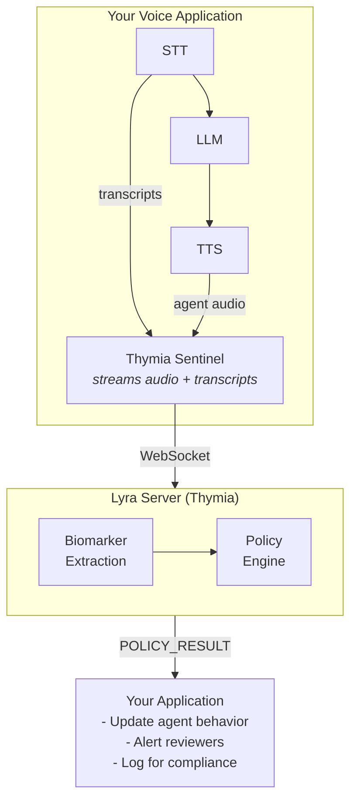

# Architecture

Sentinel implements a **monitor pattern** where biomarker analysis is decoupled from your conversational agent. This provides independent updating, clear auditability, and separation of concerns.

## System Overview



## Monitor Pattern Benefits

Rather than embedding biomarker logic within your application—where it competes with other objectives and becomes entangled with updates—Sentinel functions as a dedicated monitoring layer that observes conversations and advises your application.

| Benefit | Description |
|---------|-------------|
| **Independent updating** | Biomarker models and policies can be revised without modifying your application |
| **Robustness to changes** | When your LLM is updated, the monitoring layer continues functioning |
| **Clear auditability** | Insights originate from a dedicated component with transparent reasoning |
| **Separation of concerns** | Your agent optimizes for its task; the monitor provides situational awareness |

## Dual Output Streams

Policies can produce outputs tailored to different consumers:

**For Your Application (real-time):**

- Conversational guidance for AI agents
- Alerts and triggers for intervention
- State signals for adaptive behavior

**For Logging & Compliance:**

- Structured classifications and scores
- Reasoning traces explaining decisions
- Recommended actions with urgency timelines

## Data Flow

### 1. Audio Streaming

Your application sends audio to Sentinel:

```python
# Audio header (JSON)
{
    "type": "AUDIO_HEADER",
    "track": "user",        # or "agent"
    "format": "pcm16",
    "sample_rate": 16000,
    "channels": 1,
    "bytes": 3200
}

# Followed by raw audio bytes
```

### 2. Transcript Events

Transcripts provide semantic context for policy analysis:

```python
{
    "type": "TRANSCRIPT",
    "speaker": "user",      # or "agent"
    "text": "I'm doing okay lately",
    "is_final": true,
    "timestamp": 1234567890.123
}
```

### 3. Policy Results

When a policy triggers, you receive results:

```python
{
    "type": "POLICY_RESULT",
    "policy": "your-policy",
    "triggered_at_turn": 3,
    "timestamp": 1234567890.456,
    "result": {
        # Policy-specific output
        "alerts": [...],
        "recommended_actions": {...},
        "biomarker_summary": {...}
    }
}
```

## Scalable Oversight

This architecture supports scalable oversight—maintaining effective supervision as your system handles increasing volumes of interaction.

Sentinel serves as an intermediate layer that:

1. **Filters** — Not every conversation needs human review
2. **Structures** — Complex voice data becomes actionable signals
3. **Prioritizes** — High-priority cases surface for attention
4. **Documents** — Reasoning traces enable audit and accountability
