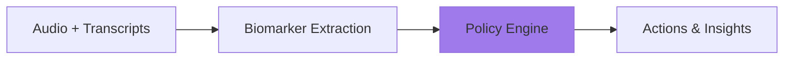

# Policies

Policies define how biomarkers and conversation context are transformed into actionable insights. Each policy specifies which biomarkers it uses, what patterns it detects, and what outputs it produces.

## How Policies Work



1. **You stream** audio and transcripts to Sentinel
2. **Lyra extracts** biomarkers in real-time
3. **Policies analyze** biomarkers + conversation context
4. **Results return** with actions for your application

## Configuring Policies

Policies are configured with Thymia based on your use case. This includes:

- Which biomarkers to use
- Detection thresholds and sensitivity
- Output format and action types
- Domain-specific reasoning

In your code, you simply reference policies by name:

```python
sentinel = SentinelClient(
    policies=["safety", "engagement"],  # Your configured policies
    # ...
)
```

## Policy Library

Thymia provides pre-built policies for common use cases. Custom policies can be created for your specific needs.

---

### safety

**Domains:** Mental Health, LLM Safety, Healthcare

**Biomarkers:** Helios (distress, stress), Apollo (depression, anxiety, symptoms), Psyche

Mental health risk classification with concordance analysis. Detects when users minimize distress, identifies crisis indicators, and provides guidance for both AI agents and human reviewers.

**Output:**
```python
{
    "classification": {
        "level": 0-3,          # none / monitor / professional_referral / crisis
        "alert": "monitor",
        "confidence": "high"
    },
    "concerns": ["elevated distress", "minimization detected"],
    "concordance_analysis": {
        "scenario": "minimization",  # concordance / minimization / amplification
        "mismatch_severity": "moderate"
    },
    "recommended_actions": {
        "for_agent": "Gently explore mood further...",
        "for_human_reviewer": "Review for clinical escalation",
        "urgency": "within_48hrs"
    }
}
```

---

### tutor-wellbeing

**Domains:** Education, Employee Wellness, HR

**Biomarkers:** Helios (burnout, fatigue, stress), Apollo (depression, anxiety), Psyche

Monitors tutor/teacher mental state during sessions. Detects burnout risk, emotional labor, and surface acting (performing positivity while exhausted). Generates self-care recommendations and retention insights.

**Output:**
```python
{
    "mental_state": {
        "burnout": 0.62,
        "fatigue": 0.55,
        "stress": 0.48,
        "interpretation": "moderate"
    },
    "surface_acting_detected": True,
    "surface_acting_rationale": "Bright language but elevated burnout biomarkers",
    "alerts": [
        {"type": "burnout_risk", "severity": "moderate", "message": "..."}
    ],
    "self_care_recommendations": [
        {"action": "take_break_after_lesson", "priority": "immediate"},
        {"action": "pace_schedule", "priority": "soon"}
    ],
    "platform_insights": {
        "retention_risk": "moderate",
        "support_recommended": True
    }
}
```

---

### student-learning

**Domains:** Education, Tutoring, Language Learning

**Biomarkers:** Helios (stress, fatigue), Apollo (anxiety), Psyche, Focus (when available)

Detects learning barriers in real-time: foreign language anxiety, cognitive overload, fatigue, frustration. Provides tutor recommendations with specific scripts.

**Output:**
```python
{
    "learning_state": {
        "foreign_language_anxiety": 0.58,
        "cognitive_load": "high",
        "willingness_to_communicate": 0.35,
        "self_efficacy": 0.42
    },
    "alerts": [
        {"type": "anxiety_high", "severity": "moderate"}
    ],
    "tutor_recommendations": [
        {
            "action": "positive_reinforcement",
            "priority": "immediate",
            "script_suggestion": "You know this! Let's break it down..."
        }
    ]
}
```

---

### caller-state

**Domains:** Contact Centers, Customer Experience, Sales

**Biomarkers:** Helios (stress, distress), Psyche (anger, fear), Apollo (irritability)

Real-time caller emotional state for contact center applications. Detects frustration, escalation risk, and satisfaction signals.

**Output:**
```python
{
    "caller_state": {
        "frustration": 0.65,
        "satisfaction": 0.22,
        "escalation_risk": "high"
    },
    "alerts": [
        {"type": "escalation_warning", "severity": "high"}
    ],
    "recommended_actions": {
        "for_agent": "Acknowledge frustration, offer concrete resolution",
        "transfer_recommended": True
    }
}
```

---

### passthrough

**Domains:** Any (for custom processing)

**Biomarkers:** Any configured

Returns raw biomarker values without interpretation. Use this when you want to build your own classification logic or integrate biomarkers into existing systems.

**Output:**
```python
{
    "type": "passthrough",
    "biomarkers": {
        "distress": 0.45,
        "stress": 0.32,
        "depression_probability": 0.28,
        # ... all configured biomarkers
    }
}
```

---

## Custom Policies

Need something specific to your domain? Thymia creates bespoke policies tailored to your use case. Examples we've built:

- **Agent evaluation** — Score AI agent conversations for safety, empathy, and compliance
- **Interview anxiety** — Detect candidate stress in hiring conversations
- **Therapy session quality** — Track client engagement and therapeutic alliance
- **Sales call analysis** — Buyer readiness and objection detection

[Contact us](mailto:support@thymia.ai) to discuss your requirements.

## Policy Triggering

Policies trigger on a **turn-based** schedule, not audio duration. A turn is each time the user or agent speaks.

- Policies run every N turns (configurable per policy)
- When a policy triggers, it uses available biomarkers at that moment
- The `triggered_at_turn` field indicates which turn triggered execution

## Using Multiple Policies

Enable multiple policies simultaneously:

```python
sentinel = SentinelClient(
    policies=["safety", "engagement", "passthrough"],
    # ...
)
```

Each policy triggers independently and you receive separate `POLICY_RESULT` events for each.
