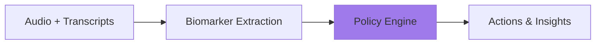

# Policies

Policies define how biomarkers and conversation context are transformed into actionable insights. Each policy specifies which biomarkers it uses, what patterns it detects, and what outputs it produces.

## How Policies Work



1. **You stream** audio and transcripts to Sentinel
2. **Lyra extracts** biomarkers in real-time
3. **Policies analyze** biomarkers + conversation context
4. **Results return** with actions for your application

## Configuring Policies

Policies are configured with Thymia based on your use case. This includes:

- Which biomarkers to use
- Detection thresholds and sensitivity
- Output format and action types
- Domain-specific reasoning

In your code, you simply reference policies by name:

```python
sentinel = SentinelClient(
    policies=["demo_wellbeing_awareness"],  # Your configured policies
    # ...
)
```

## Policy Library

Thymia provides pre-built policies for common use cases. Custom policies can be created for your specific needs.

---

### wellbeing-awareness

**Type:** `safety_analysis`

**Domains:** Mental Health, Conversational AI, Healthcare, Education, Coaching

**Biomarkers:** Helios (distress, stress, burnout, fatigue, low_self_esteem), Apollo (depression, anxiety, symptoms), Psyche (real-time voice emotions)

Conversational wellbeing awareness system that combines voice biomarkers with conversation context. Performs concordance analysis between what users say and how they sound, detecting minimization, and providing gentle, non-clinical guidance for AI agents.

**Awareness Levels:**

| Level | Alert | Description |
|-------|-------|-------------|
| 0 | `none` | All clear, no concerns |
| 1 | `aware` | Be attentive, mild indicators |
| 2 | `supportive` | Be supportive and mindful, moderate indicators |
| 3 | `mindful` | Be very mindful, notably elevated signals |

**Output:**
```python
{
    "type": "safety_analysis",
    "classification": {
        "level": 0-3,          # none / aware / supportive / mindful
        "alert": "aware",
        "confidence": "high"
    },
    "concerns": ["slightly elevated stress", "mood not yet discussed"],
    "concordance_analysis": {
        "scenario": "mood_not_discussed",  # mood_not_discussed / concordance / minimization / amplification
        "agreement_level": "n/a",
        "mismatch_type": "not_yet_discussed",
        "mismatch_severity": "none"
    },
    "recommended_actions": {
        "for_agent": "Find a natural moment to ask how they're feeling",
        "for_human_reviewer": "Brief note for session review",
        "urgency": "routine"       # routine / follow_up / attentive / supportive
    }
}
```

---

### extracted-fields

**Type:** `extracted_fields`

**Domains:** Any (structured data extraction from conversation)

**Biomarkers:** None required

Extracts basic user fields (name, age) from the conversation in real-time. Each field includes a confidence score and the source utterance it was extracted from.

**Output:**
```python
{
    "type": "extracted_fields",
    "fields": {
        "name": {
            "value": "Greg",
            "confidence": 1.0,
            "source": "User:  My name is Greg."
        },
        "age": {
            "value": None,
            "confidence": 0.0,
            "source": None
        }
    },
    "notes": "The user explicitly stated their name as Greg. No age information was provided in the conversation."
}
```

---

### student-monitor

**Type:** `safety_analysis`

**Domains:** Education, Tutoring, Online Learning

**Biomarkers:** Helios (stress, fatigue), Apollo (concentration, restlessness, irritability, psychomotor, low_energy), Psyche (neutral, happy, angry)

Classifies student wellness during tutoring sessions using conversation content as the primary signal and voice biomarkers as a secondary signal. Detects off-topic drift, lesson difficulty, and emotional shutdown. Provides tutor recommendations with specific scripts.

Conversation content drives the classification — biomarkers can escalate by one level but never override clear conversational signals.

**Classification Levels:**

| Level | Alert | Description |
|-------|-------|-------------|
| 0 | `none` | On track, engaged and on-topic |
| 1 | `on_track` | Borderline, worth watching |
| 2 | `check_in` | Check understanding, consider switching approach |
| 3 | `support_needed` | Acknowledge difficulty, consider a break |

**Output:**
```python
{
    "type": "safety_analysis",
    "classification": {
        "level": 0-3,          # none / on_track / check_in / support_needed
        "alert": "check_in",
        "confidence": "high"
    },
    "biomarker_summary": {
        "stress": 0.35,
        "fatigue": 0.32,
        "concentration": 0.42,
        "restlessness": 0.25,
        "irritability": 0.30,
        "psychomotor": 0.18,
        "low_energy": 0.28,
        "neutral": 0.60,
        "happy": 0.10,
        "angry": 0.20,
        "interpretation": "mild"
    },
    "tutor_recommendations": [
        {
            "action": "acknowledge_difficulty",
            "priority": "immediate",
            "script_suggestion": "That's OK! This is genuinely a tricky topic."
        },
        {
            "action": "slow_down",
            "priority": "soon",
            "script_suggestion": "Let's try a different approach..."
        }
    ],
    "rationale": "Student has expressed confusion twice and cannot engage with the analogy.",
    "recommended_actions": {
        "for_agent": "Acknowledge the difficulty, slow down, and try a different approach",
        "for_human_reviewer": "Student showing difficulty signals, may need alternative explanation"
    }
}
```

**Available tutor actions:** `positive_reinforcement`, `slow_down`, `take_break`, `check_understanding`, `acknowledge_difficulty`, `switch_activity`

---

### passthrough

**Domains:** Any (for custom processing)

**Biomarkers:** Any configured

Returns raw biomarker values without interpretation. Use this when you want to build your own classification logic or integrate biomarkers into existing systems.

**Output:**
```python
{
    "type": "passthrough",
    "biomarkers": {
        "distress": 0.45,
        "stress": 0.32,
        "depression_probability": 0.28,
        # ... all configured biomarkers
    }
}
```

---

## Custom Policies

Need something specific to your domain? Thymia creates bespoke policies tailored to your use case. Examples we've built:

- **Agent evaluation** — Score AI agent conversations for safety, empathy, and compliance
- **Interview anxiety** — Detect candidate stress in hiring conversations
- **Therapy session quality** — Track client engagement and therapeutic alliance
- **Sales call analysis** — Buyer readiness and objection detection

[Contact us](mailto:support@thymia.ai) to discuss your requirements.

## Policy Triggering

Policies trigger on a **turn-based** schedule, not audio duration. A turn is each time the user or agent speaks.

- Policies run every N turns (configurable per policy)
- When a policy triggers, it uses available biomarkers at that moment
- The `triggered_at_turn` field indicates which turn triggered execution

## Using Multiple Policies

Enable multiple policies simultaneously:

```python
sentinel = SentinelClient(
    policies=["demo_wellbeing_awareness", "demo_field_extraction"],
    # ...
)
```

Each policy triggers independently and you receive separate `POLICY_RESULT` events for each.

### `policy` vs `policy_name`

Every `POLICY_RESULT` event includes two identifying fields:

- **`policy`** — the **executor type** that produced the result (e.g., `"safety_analysis"`, `"passthrough"`)
- **`policy_name`** — the **name of the specific policy** from your org config (e.g., `"student_monitor"`, `"safety"`)

Multiple policies can share the same executor. For example, you might have two policies — `"student_monitor"` and `"employee_wellbeing"` — that both use the `"safety_analysis"` executor with different configuration. Use `policy_name` to distinguish which policy produced each result:

```python
@sentinel.on_policy_result
async def handle_result(result: PolicyResult):
    policy_name = result.get("policy_name", result["policy"])

    if policy_name == "student_monitor":
        await handle_student_safety(result)
    elif policy_name == "employee_wellbeing":
        await handle_employee_wellbeing(result)
```
