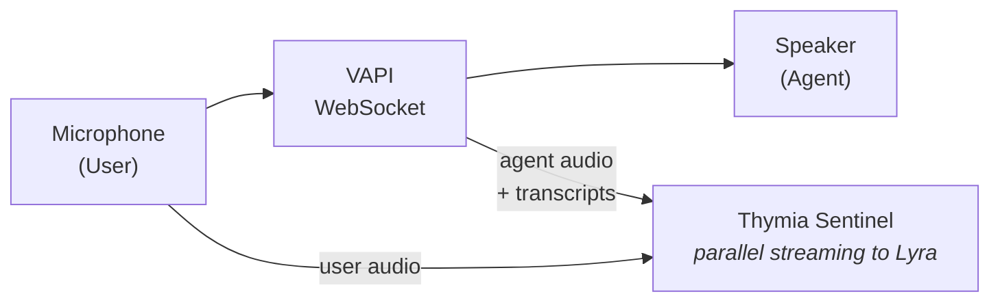

# VAPI Integration

The VAPI integration shows how to use Sentinel with VAPI's WebSocket transport for bidirectional audio streaming.

## Installation

```bash
cd examples/vapi_api
uv sync

# On macOS, you also need:
brew install portaudio
```

## Architecture



## Quick Start

```python
import asyncio
from thymia_sentinel import SentinelClient

async def main():
    # Create VAPI call
    call_data = await create_websocket_call()
    ws_url = call_data["transport"]["websocketCallUrl"]

    # Initialize Sentinel
    sentinel = SentinelClient(
        user_label="user-123",
        policies=["safety"],
        on_policy_result=handle_policy_result,
    )

    await sentinel.connect()

    async with websockets.connect(ws_url) as ws:
        await asyncio.gather(
            send_microphone_audio(ws, sentinel, mic_stream),
            receive_vapi_messages(ws, sentinel, speaker_stream),
        )

    await sentinel.close()
```

## Streaming Audio

```python
async def send_microphone_audio(ws, sentinel, mic_stream):
    while True:
        audio = mic_stream.read(CHUNK_SIZE)

        # Send to VAPI
        await ws.send(audio)

        # Send to Sentinel
        await sentinel.send_user_audio(audio)

async def receive_vapi_messages(ws, sentinel, speaker_stream):
    async for message in ws:
        if isinstance(message, bytes):
            # Agent audio
            speaker_stream.write(message)
            await sentinel.send_agent_audio(message)
        else:
            # JSON message (transcripts, etc.)
            data = json.loads(message)
            await handle_vapi_message(data, sentinel)
```

## Handling VAPI Messages

```python
async def handle_vapi_message(data: dict, sentinel):
    msg_type = data.get("type")

    if msg_type == "transcript":
        role = data.get("role")
        text = data.get("transcript")
        is_final = data.get("transcriptType") == "final"

        if is_final and text:
            if role == "user":
                await sentinel.send_user_transcript(text)
            elif role == "assistant":
                await sentinel.send_agent_transcript(text)
```

## Injecting Safety Actions

Use VAPI's `add-message` control message:

```python
async def apply_recommended_action(action: str, ws):
    message = {
        "type": "add-message",
        "message": {
            "role": "system",
            "content": f"SAFETY UPDATE: {action}",
        },
        "triggerResponseEnabled": False,
    }
    await ws.send(json.dumps(message))
```

## Environment Variables

```bash
THYMIA_API_KEY=your-api-key
VAPI_PRIVATE_API_KEY=your-vapi-key
```

## Running the Example

```bash
cd examples/vapi_api
cp .env.example .env.local
# Edit .env.local with your API keys

uv run python src/agent.py
```

The example will create a VAPI call and start a local audio session using your microphone and speakers.
