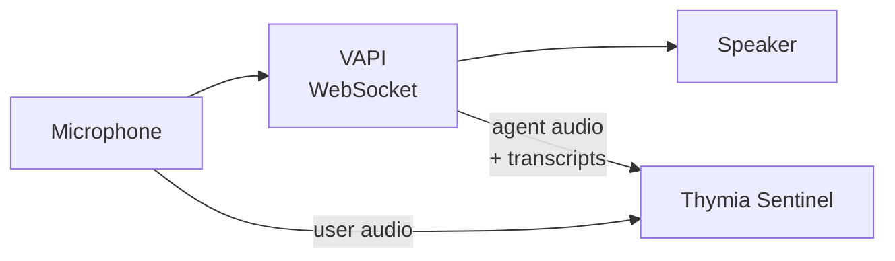

# VAPI + Thymia Sentinel

Real-time voice biomarker monitoring for [VAPI](https://vapi.ai) using WebSocket transport.

## Features

- **Bidirectional audio streaming** — Capture both user microphone and agent TTS
- **Transcript forwarding** — VAPI transcripts sent to Sentinel automatically
- **Action injection** — Safety recommendations injected mid-conversation

## Architecture



## Quick Start

### 1. Install Dependencies

```bash
uv sync

# On macOS:
brew install portaudio
```

### 2. Configure Environment

```bash
cp .env.example .env.local
```

```bash
# VAPI (use PRIVATE key for WebSocket transport)
VAPI_PRIVATE_API_KEY=your-private-key

# Thymia
THYMIA_API_KEY=your-thymia-api-key
```

### 3. Run

```bash
uv run python src/agent.py
```

Speak into your microphone to interact with the assistant.

## Usage

```python
from thymia_sentinel import SentinelClient, PolicyResult

async def main():
    # Create VAPI call
    call_data = await create_websocket_call()
    ws_url = call_data["transport"]["websocketCallUrl"]

    sentinel = SentinelClient(
        user_label="user-123",
        policies=["safety"],
    )

    @sentinel.on_policy_result
    async def handle_policy_result(result: PolicyResult):
        inner = result.get("result", {})
        if inner.get("type") == "safety_analysis":
            level = inner["classification"]["level"]
            if level >= 2:
                action = inner["recommended_actions"]["for_agent"]
                # Inject safety action into VAPI
                await apply_action(action, ws)

    await sentinel.connect()

    async with websockets.connect(ws_url) as ws:
        await asyncio.gather(
            send_microphone_audio(ws, sentinel),
            receive_vapi_messages(ws, sentinel),
        )

    await sentinel.close()

async def send_microphone_audio(ws, sentinel):
    while True:
        audio = mic_stream.read(CHUNK_SIZE)
        await ws.send(audio)
        await sentinel.send_user_audio(audio)

async def receive_vapi_messages(ws, sentinel):
    async for message in ws:
        if isinstance(message, bytes):
            speaker_stream.write(message)
            await sentinel.send_agent_audio(message)
        else:
            data = json.loads(message)
            if data.get("type") == "transcript":
                text = data.get("transcript")
                role = data.get("role")
                if data.get("transcriptType") == "final" and text:
                    if role == "user":
                        await sentinel.send_user_transcript(text)
                    elif role == "assistant":
                        await sentinel.send_agent_transcript(text)
```

## Injecting Safety Actions

```python
async def apply_action(action: str, ws):
    message = {
        "type": "add-message",
        "message": {"role": "system", "content": f"SAFETY: {action}"},
        "triggerResponseEnabled": False,  # Don't interrupt
    }
    await ws.send(json.dumps(message))
```

## Configuration

| Parameter | Type | Default | Description |
|-----------|------|---------|-------------|
| `user_label` | `str` | `None` | Unique user identifier |
| `date_of_birth` | `str` | `None` | YYYY-MM-DD format (improves accuracy) |
| `birth_sex` | `str` | `None` | "MALE" or "FEMALE" (improves accuracy) |
| `policies` | `list[str]` | `["passthrough"]` | Policies to run |
| `biomarkers` | `list[str]` | `["helios"]` | Biomarkers to extract |

## Project Structure

```
vapi_api/
├── src/
│   ├── agent.py           # VAPI WebSocket client
│   └── prompts.py         # System prompts
├── pyproject.toml
└── README.md
```

## Troubleshooting

- **No WebSocket URL?** — Use PRIVATE API key, not public
- **No audio?** — Check microphone permissions, install portaudio

## License

MIT License — see [LICENSE](../../LICENSE)
